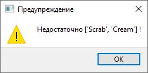

# Beauty
Данный проект представляется из себя прототип CRM-приложения для кабинетов красоты в сфере услуг. Приложение позволяет вести учет материалов и рассчитывать себестоимость услуги.

*Разработка велась в рамках выпускной квалификационной работы курсов профессиональной переподготовки на базе СПБПУ "Высшая инженерная школа" по направлению "Разработчик прикладного программного обеспечения (Язык Python)"*
## Quickstart
Для удобства весь проект был собран в 1 файл с помощью инструмента "PyInstaller". Для быстрого старта необходимо скачать и распаковать ZIP-архив из папки EXE. Файл "Beauty.exe" запускает приложение.
## How to use it ?
#### При запуске приложения по умолчанию открывается окно со складом:

1. Для управления материалами использются кнопки в **3** области.
2. Для изменения позиции, помимо соответствующей кнопки, можно использовать двойной клик по предмету в **1** области.
3. Во **2** области выводится суммарная стоимость всех позиций склада.

Для создания/изменения предмета используется соответствующее окно:

#### Для создания услуги используется соответствующая вкладка:

1. Для управления, аналогично складу, используется **2** область. Двойной клик также позволяет изменять позиции.
2. Кнопка "Сделать" списывает материалы согласно их расходу на 1 услугу. При случайном списании можно все вернуть кнопкой "Откатить".
3. При недостаточном количестве материалов выводится соответствующее предупреждение:

Для создания/изменения используется соответствующее окно:

1. Для добавления предмета в услугу необходимо сделать двойной клик по соответствующей позиции на складе в **3** области.
2. Для удаления предмета из услуги также используется двойной клик по позиции во **2** области.
3. Расход предмета на 1 применение услуги вписывется вручную в соответствующую ячейку во **2** области.
4. Название услуги и ее стоимость задется в **1** области.

## Authors
Неженский Егор Алекссевич
